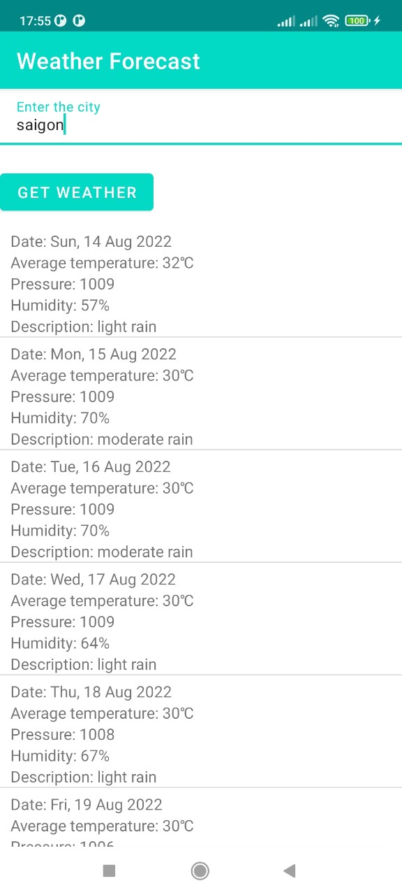

Nab-Android-Challenge Application
===========================================================

# Weather Forecast App
This app was built with

- SOLID principle
- Kotlin language(100%)
- MVVM architecture
- Livedata
- DataBinding/Binding Adapter
- Coroutines(Asynchronous Tasks)
- Kotlin Extension Functions
- Dagger Hilt(Dependency Injection)
- Retrofit(Networking)
- Gson(Json Object Parsing)
- Room(Local Database)
- Cache Strategy (Repository Pattern)
- Unit Test

# Result

# Architecture

## MVVM architecture
 
### 1. Model
- Model represents the data and business logic of the app. Model represents the data and business logic of the app. One of the recommended implementation strategies of this layer, is to expose its data through observables to be decoupled completely from ViewModel or any other observer/consumer.

### 2. View
- The view role in this pattern is to observe (or subscribe to) a ViewModel observable to get data in order to update UI elements accordingly.

### 3. ViewModel
- ViewModel interacts with model and also prepares observable(s) that can be observed by a View. ViewModel can optionally provide hooks for the view to pass events to the model.
  One of the important implementation strategies of this layer is to decouple it from the View, i.e, ViewModel should not be aware about the view who is interacting with.

# Project Packages Overview
| 

# Entity & Database

| Entity | Database |
|:-:|:-:|
|  |  |

# Secured sensitive info
1. Open weather App ID: Store App ID into secure.properties file(which is might not be pushed to git version control). Use EncryptedSharedPreference API to encrypt this App ID and save it into secured SharedPreference.
  
- | secure.properties | Shared Preference |
  |:-:|:-:|
  |  |  |

# Building project guide
First, I assume that you cloned the repository and open it in Android Studio already. Then do following next steps.

+ From android studio, open app folder.
+ Modify secure.properties file with your YOUR_OPEN_WEATHER_APP_ID.

DONE
- Now, you can build the app with a real android phone/tablet or an emulator.

# Checklist

- [x] 1. The application is a simple Android application which is written by Java/Kotlin.
- [x] 2. The application is able to retrieve the weather information from OpenWeatherMaps API.
- [x] 3. The application is able to allow user to input the searching term.
- [x] 4. The application is able to proceed searching with a condition of the search term length must be
   from 3 characters or above.
- [x] 5. The application is able to render the searched results as a list of weather items.
- [x] 6. The application is able to support caching mechanism so as to prevent the app from generating a
   bunch of API requests.
- [x] 7. The application is able to manage caching mechanism & lifecycle.
- [x] 8. The application is able to handle failures.
- [x] 9. The application is able to support the disability to scale large text for who can't see the text
   clearly.
- [x] 10. The application is able to support the disability to read out the text using VoiceOver controls.